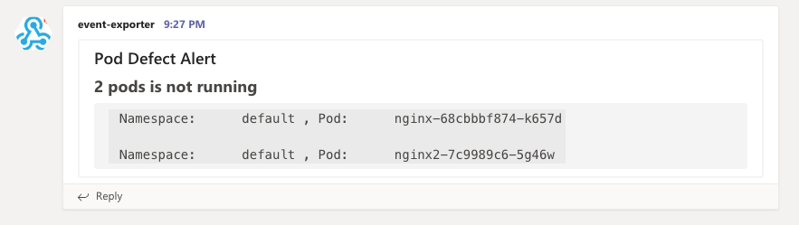
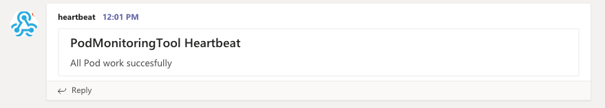

# PodMonitoringTool

The PodMonitoringTool is simple and lightweight alerting tool for pods on Kubernetes.
Basically, there are some great monitoring tool like [Prometheus](https://github.com/prometheus/prometheus).
However, sometimes we don't need those complicated one.

We usually check the pod status briefly by using following command like below.
In this case, we can find those pods are NOT ready.

```
❯ kubectl get po
NAME                     READY   STATUS    RESTARTS   AGE
nginx-68cbbbf874-k657d   0/1     Running   0          15m
nginx2-7c9989c6-5g46w    0/1     Running   0          15m
```

This tool allow us to monitor status of pods at specific namespace.
Once this tool detect pod failure, this tool send alert to MS Teams.

# Usage

**This tool works as both inside cluster pod and go application outside cluster.**

# Inside Cluster

## Configuration

**Set environment variables like below**

Please modify kubernetes/deploy_pod_monitoring_tool.yaml like below.

```
        env:
        # !! replace TEAMS_ENDPOINT with your Teams webhook endpoint
        # - name: TEAMS_ENDPOINT
        #   value: "https://outlook.office.com/webhook/XXXXXXXX"
        - name: OBSERVE_PERIOD
          value: "10"
        - name: OBSERVED_NAMESPACE
          value: "default"
```

## Launch

**Run this tool simply**

```
kubectl apply -f ./kubernetes/prerequisite.yaml
kubectl apply -f ./kubernetes/deploy_pod_monitoring_tool.yaml
```

```
❯ kubectl get po -n pod-monitoring
NAME                                   READY   STATUS        RESTARTS   AGE
pod-monitoring-tool-555688b96-b2z2t    1/1     Running       0          4s
```

## Verification

**The following manifests can be used to verify that this tool works successfully.**

```
❯ kubectl apply -f ./kubernetes/failure_test
deployment.apps/nginx created
deployment.apps/nginx2 created
```

**And then, you can find 2 pods is in failed state.**

The alert can be found in your MS Teams like below.



# Outside Cluster

## Configuration

**Set environment variables like below**

```
NAMESPACE="default"
TEAMS_ENDPOINT="https://outlook.office.com/webhook/XXXXXXXXXXXXX"
OBSERVE_PERIOD=10
```

## Launch

**Run this tool simply**

```
❯ go run app/*
2020/08/16 21:26:17 OBSERVE_PERIOD is  10
2020/08/16 21:26:17 All Pod work succesfully
2020/08/16 21:26:27 All Pod work succesfully
```

## Verification

**The following manifests can be used to verify that this tool works successfully.**

```
❯ kubectl apply -f ./kubernetes/failure_test
deployment.apps/nginx created
deployment.apps/nginx2 created
```

**And then, you can find 2 pods is in failed state.**

```
❯ go run app/*
2020/08/16 21:27:04 OBSERVE_PERIOD is  10
2020/08/16 21:27:04 2 pods is not running
2020/08/16 21:27:04 1
2020/08/16 21:27:04      default         nginx-68cbbbf874-k657d
2020/08/16 21:27:04 2
2020/08/16 21:27:04      default         nginx2-7c9989c6-5g46w
```

The alert can be found in your MS Teams like below.


# Options

if you set TEAMS_HEARTBEAT_ENDPOINT variable, succesful notification can be notified every observation period like below.

